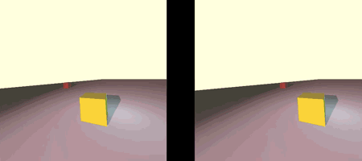
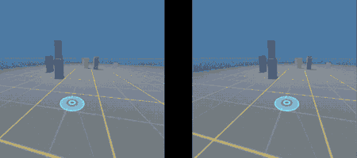

# pyVR

This repository contains a set of Python routines designed to create VR experiences using the HARFANG 3D engine. The engine allows for comprehensive creation of 3D VR environments and interactive experiences.

- `scene_vr_basic.py`: Provides the basic structure for creating VR scenes.
- `scene_vr_controllers.py`: Introduces VR controller support, enabling interactive elements within the VR environment.
- `scene_vr_coroutine_basic.py`: Contains basic coroutine functionality for implementing sequential logic without blocking the rest of the VR scene processing.
- `scene_vr_teleporter.py`: Includes a teleportation mechanic for VR, allowing users to navigate within the virtual environment.

